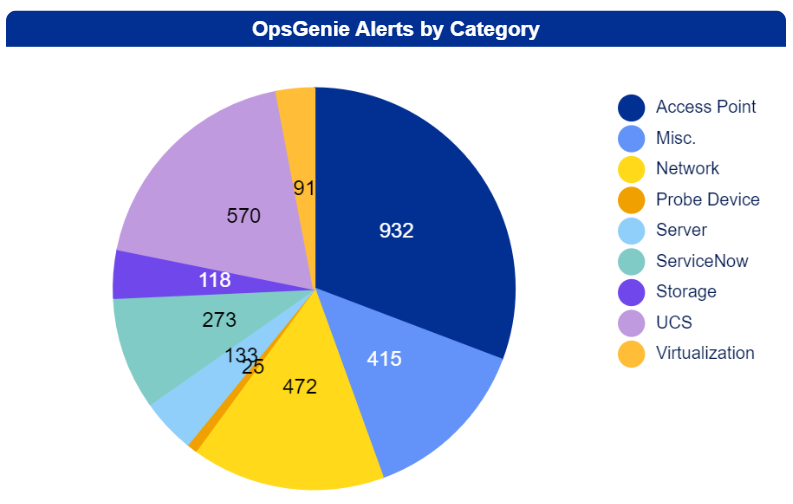
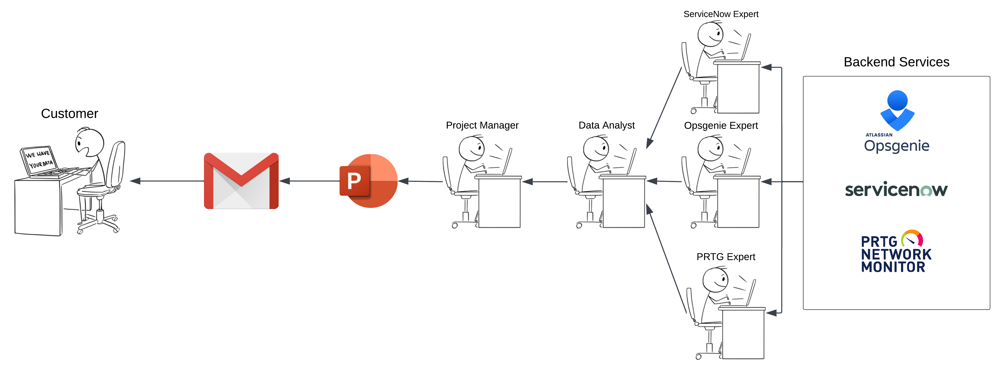
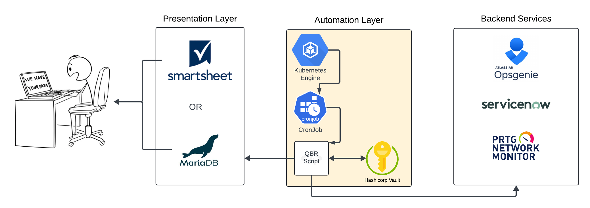

<!-- _class: title -->
# Quaraterly Business Report Automation
Anthony Farina
DevOps Engineer
Computacenter US

---
# Background

- Project managers need to run quarterly business reports
  - Reports include alert and ticket data in the form of graphs
  - This is a very manual process as PMs need to aggregate the raw data and put it into graphs / charts
- If we can aggregate this data into a dashboarding tool, we can make graphs of the data quickly
  - This can save PMs lots of time

---
# Fossilized Diagram

---
# Automated Diagram

---
# Quarterly Business Report Automation - Code Tour

# 
Code Tour!

