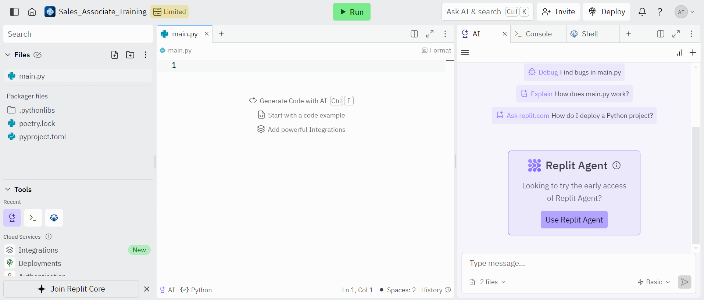

<!-- _class: title -->
# Getting Started with Replit
Anthony Farina
DevOps Engineer
Computacenter US


---
# What is Replit?
<div style='margin-top:60px'></div>
<div class="columns">
<div>

- Replit is an online IDE (Integrated Development Environment)
- Write code online and Replit will compile it & run it for you
- Supports lots of different software languages
- We'll be using it to run Python code

</div>
<div>


</div>
</div>


---
# Make Your First Repl
<div style='margin-top:60px'></div>
<div class="columns">
<div>

- Go to: https://www.replit.com/
- "Sign up for free"
- Use your Computacenter email to register your account
- In the top left corner, select: "+ Create Repl"
- Select the "Python" template on the left (use the search bar if needed)
- Name your Repl on the right
- Towards the bottom of the popup, select "+ Create Repl"

</div>
<div>



</div>
</div>


---
# "Hello World!" Program
<div style='margin-top:60px'></div>
<div class="columns">
<div>

- Navigate to "main.py"
- Type:

```python
print("Hello, World!")
```

- Press the green "Run" button at the top
- You should see "Hello, World!" in your console tab on the right
- One step closer to becoming a developer!

</div>
<div>


</div>
</div>
