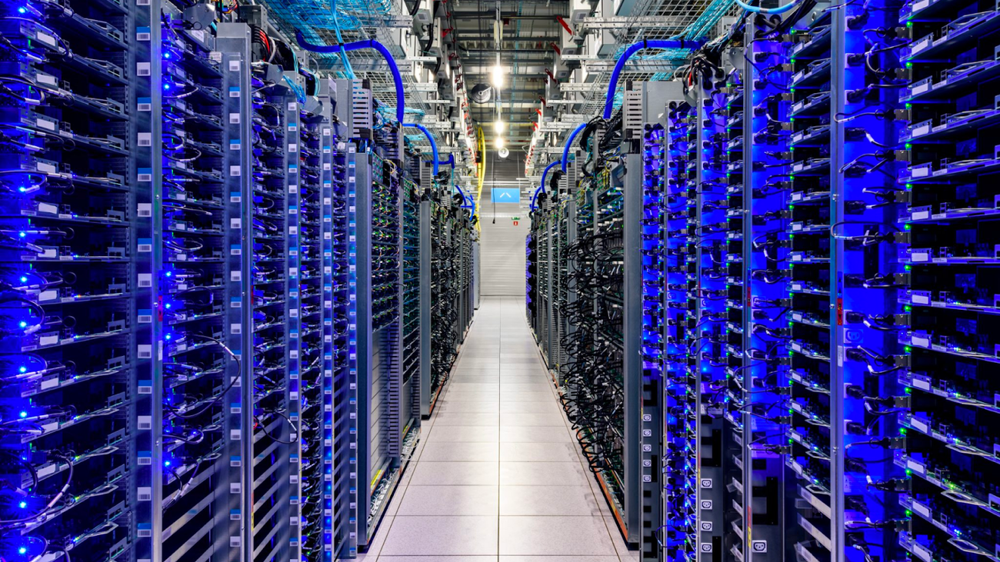
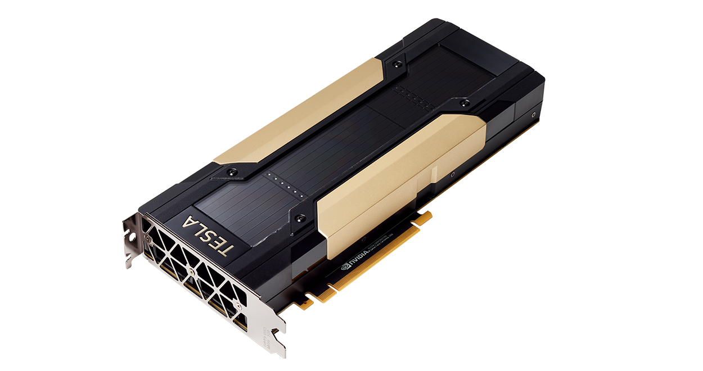
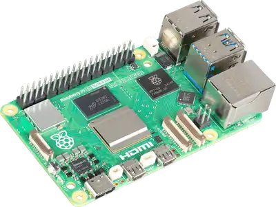

# The Cloud
Anthony Farina
DevOps Engineer
Computacenter - Professional Services Consultancy Practice

---

# What is "The Cloud"?

- The on-demand access to server resources at datacenters
  - A single datacenter is made up of 100's if not 1,000's of servers
- Allows you to use digital services provided by companies
  - You don't need to download software to use services
- Examples: Netflix, Google Drive, ChatGPT

---

# NVIDIA Tesla V100 vs. Raspberry Pi

- Uses its own resources
- 640 Tensor Cores
- 32 GB RAM

- Integrated graphics (no physical GPU)
- 4 CPU cores
- At most 16 GB RAM

---

# Simulating the Cloud Using 2 Pi's

- A user will make a prompt on this pi and it will send that prompt to the other pi
------------------------------------->

- This pi will recieve the prompt, run an Ollama AI model, generate a response, and send it back to the first pi
<-------------------------------------

---

# Using the Real Cloud

- Rich set up a V100 in the Cloud for us to use!
- The AI model we'll be using is DeepSeek-R1
- DeepSeek is an LLM development company based out of China

