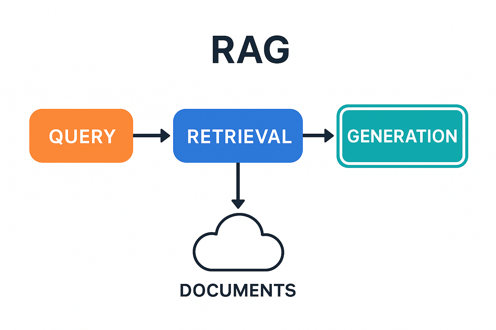

<!-- _class: title -->
# Retrieval Augmented Generation

Jonny Le
Computacenter Digital Innovation
CC Sales Associate Training 2/10/2026 - 2/11/2026

---

# The Problem

<div class="columns">
<div>

- Old data
- Too broad
- Public data

</div>
<div>


</div>
</div>

---

# Why RAG?

<div class="columns">
<div>

You: Why do we need RAG if we can just train another model with the data?

```console
You: Why do we need RAG if we can just train another model with the data?
AI: That’s an *excellent* question! It gets to the heart of why RAG is so powerful. You're 
right, in theory, you *could* train a large language model (like ChatGPT) directly on a 
huge dataset. But here's why RAG is often a better approach:

*   **Cost and Scale:** Training a massive language model from scratch is *incredibly* 
expensive – we're talking millions of dollars and a huge amount of computing power. It also 
takes a *lot* of time.

*   **Keeping Data Up-to-Date:** Language models are only as good as the data they were 
trained on. If the data changes (like new scientific discoveries, evolving facts, or updated 
company information), you have to *retrain* the entire model. RAG avoids this because you're 
just adding new information to the "Knowledge Base" – it doesn’t require retraining the core 
model.

*   **Specificity and Relevance:**  A general language model has a vast amount of knowledge, 
but it might not be the *most* relevant for your specific task. RAG allows you to focus the 
model's attention on the *exact* information needed for the question. It's like giving the 
model a targeted briefing instead of a huge, overwhelming textbook.

*   **Trust and Explainability:** RAG makes it easier to trace where the information came from. 
Because the model retrieves information from a known source (the Knowledge Base), you can 
check the source and verify the answer’s accuracy. With a purely trained model, it’s much 
harder to understand *why* it gave a particular answer.

**Think of it this way:** Training a model is like building a giant, complex machine. RAG is 
like giving that machine a really good, specific tool for the job, and updating that tool 
whenever needed – much more efficient and controllable!

Do you want me to elaborate on any of these points, or perhaps give you a specific example 
to illustrate the difference?
```

</div>
<div>

AI:

- **Cost and Scale:**
- **Keeping Data Up-to-Date:**
- **Specificity and Relevance:**
- **Trust and Explainability:**

"**Think of it this way:** Training a model is like building a giant, complex machine. RAG is like giving that machine a really good, specific tool for the job, and updating that tool whenever needed..."

</div>
</div>

---

# What is RAG?

```console
Connected to Ollama at http://localhost:11434 using 'gemma3:4b'
Type 'quit', 'exit', or 'bye' to end the chat.

You: Can you explain retrieval augmented generation to me like I am 10 years old?
AI: Okay, let's imagine you're building a really awesome LEGO castle!

Normally, if you just got a big box of LEGOs and told a robot to build a castle, it might make a 
pretty messy castle, right? It wouldn't know what a *real* castle looks like!

**Retrieval Augmented Generation (RAG) is like this:**

1. **The Robot Needs a Blueprint:** First, we give the robot a special book filled with pictures 
and information about castles - like how tall towers should be, what colors are common, and even 
what knights might wear!  This book is like a *database* of information.

. . .
```

<!--
- Different model
- Context changes answer
-->

---

# What is RAG? Pt. 2

```console
You: Can you explain that again in a few sentences?
AI: Okay, let’s keep it simple! Imagine a robot needs to answer 
your questions – RAG is like giving it a super helpful notebook 
full of facts. Before it answers, it quickly looks through that 
notebook to find the best information related to your question, 
then uses *both* the question and the notebook info to give you 
a really good answer!
```

<!-- 
- Memory
- Probably meant brain instead of 'both question'
 -->

---

# RAG Diagram

```console
You: Can you explain RAG using ASCII art?
AI: Okay, let’s try to represent RAG with ASCII art! It’s tricky, but here’s an attempt:
+-----------------+       +-----------------+       +-----------------+
|   Question     |------>|   Search       |------>|   Generate      |
+-----------------+       |   (Knowledge)   |       |   Answer        |
     ^                  |     Base        |       +-----------------+
     |                  |                 |
     |                  v                 |
     +------------------+-----------------+
     |                      |
     |  +-----------------+  |
     |  | Knowledge Base |  |
     |  +-----------------+  |
     |                      |
     +----------------------+
```

<!--
- 'diagram in text' to 'ASCII art'
- asked to fix the lines
-->

---

# RAG Diagram Pt. 2

&nbsp; <!--to pad top of codeblock-->

```console
You: Can you create a diagram of RAG using ASCII art?
. . .
You: Can you create the diagram horizontally?
Copilot:
 User Query
      |
      v
+-------------+      +-------------------+      +-------------------------+
| Embed Query | ---> | Vector Store (kNN)| ---> | Retrieved Docs (Top-K) |
+-------------+      +-------------------+      +-------------------------+
                                                           |
                                                           v
                                                +-------------------------+
                                                |  Construct Prompt       |
                                                | (Query + Retrieved Docs)|
                                                +-------------------------+
                                                           |
                                                           v
                                                +-------------------------+
                                                |   LLM Generates Answer  |
                                                +-------------------------+
                                                           |
                                                           v
                                                      Response
```

---

# RAG Diagram Pt. 3

&nbsp; <!--to pad top of codeblock-->

```console
You: Generate an image of a diagram explaining RAG.
Copilot:
```


