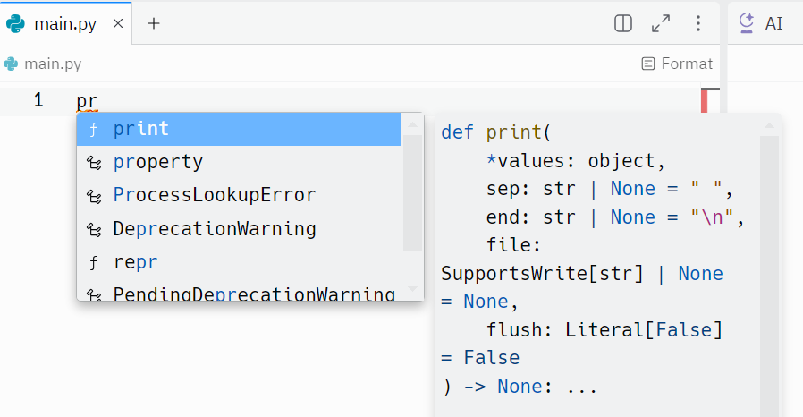

<!-- _class: title -->
# Getting Started with Replit
Anthony Farina
DevOps Engineer
Computacenter US


---
# What is Replit?
<div style='margin-top:60px'></div>
<div class="columns">
<div>

- Replit is an online IDE (Integrated Development Environment)
- Write code online and Replit will compile it & run it for you
- Supports lots of different software languages
- We'll be using it to run Python code

</div>
<div>


</div>
</div>


---
# Make Your First Repl
<div style='margin-top:60px'></div>
<div class="columns">
<div>

- Go to: https://www.replit.com/
- "Sign up for free"
- Use your Computacenter email to register your account
- In the top left corner, select: "+ Create Repl"
- Select the "Python" template on the left (use the search bar if needed)
- Name your Repl on the right
- Towards the bottom of the popup, select "+ Create Repl"

</div>
<div>


</div>
</div>


---
# "Hello World!" Program
<div style='margin-top:60px'></div>
<div class="columns">
<div>

- Navigate to "main.py"
- Type:

```python
print("Hello, World!")
```

- Press the green "Run" button at the top
- You should see "Hello, World!" in your console tab on the right
- One step closer to becoming a developer!

</div>
<div>



</div>
</div>


---
# Conditionals
<div style='margin-top:60px'></div>
<div class="columns">
<div>

- Conditionals are pieces of code that check if a condition is true or false
- In math, we know that 1 = 1
- This is a "true" mathematical statement
- However, we know that 1 =/= 2
- This is a "false" mathematical statement
- "if-else" statements allow us to check if a condition is met

</div>
<div>

```python
x = 1
y = 2

if x == y:
  print("Condition is true")
else:
  print("Condition is false")
```

</div>
</div>


---
# Loops
<div style='margin-top:60px'></div>
<div class="columns">
<div>

- Loops are blocks of code that will run again and again until a condition is met
- As long as the looping condition is true, the loop will continue
- When the condition becomes false, the loop will end
- Watch out for infinite loops!

</div>
<div>

```python
x = 1

while x <= 10:
  print("x is " + x)
  x = x + 1

print("I am done")
```

</div>
</div>


---
# Quarterly Business Report Automation - Background
<div style='margin-top:60px'></div>
<div class="columns">
<div>

- Project managers need to run quarterly business reports
  - Reports include alert and ticket data in the form of graphs
  - This is a very manual process as PMs need to aggregate the raw data and put it into graphs / charts
- If we can aggregate this data into a dashboarding tool, we can make graphs of the data quickly
  - This can save PMs lots of time

</div>
<div>


</div>
</div>

---
# Quarterly Business Report Automation - Code

# <center>Code Tour!</center>


---
# A Bit About Me
<div style='margin-top:60px'></div>

- Live in Edison, NJ
- Virginia Tech 2020 graduate
  - BS in Computer Science
- Working at Computacenter since February 2021
- Passionate gamer
  - Fortnite
  - Clash of Clans
  - Satisfactory


---
