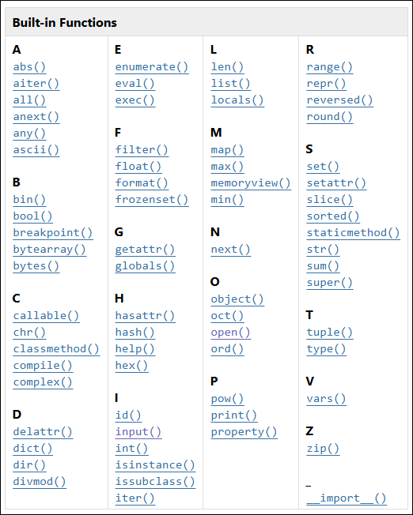

<!-- _class: title -->
# Functions and Libraries
Jonny Le
Computacenter Digital Innovation
CC Sales Associate Training 10/09/2024 - 10/10/2024

---

# Problem

```python
# form to sign up

first_name = input('Enter first name: ')
# validate first name
if len(first_name) < 1:
    raise ValueError('Cannot be empty')

last_name = input('Enter last name: ')
# validate last name
if len(last_name) < 1:
    raise ValueError('Cannot be empty')

username = input('Enter username: ')
# validate username
if len(username) < 1:
    raise ValueError('Cannot be empty')
```

---

# Functions

<div class="columns">
<div>

```python
# form to sign up

def prompt_and_validate(prompt):
    data = input(prompt)
    if len(data) < 1:
        raise ValueError('Cannot be empty')
    return data

first_name = prompt_and_validate('Enter first name: ')
last_name = prompt_and_validate('Enter last name: ')
username = prompt_and_validate('Enter username: ')
```

</div>
<div>

- Block of **reusable** code
- Takes an input (sometimes)
- Returns an output

  or

- Creates a side effect

</div>
</div>

---

# Built-in Functions

<div class="columns">
<div>

- `print()`, `input()`, `open()`, `len()`
- 

</div>
<div>


https://docs.python.org/3/library/functions.html

</div>
</div>

---

# `def`ining Functions

- 

---

# Libraries

---

# Standard and External Libraries
