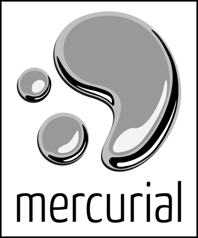
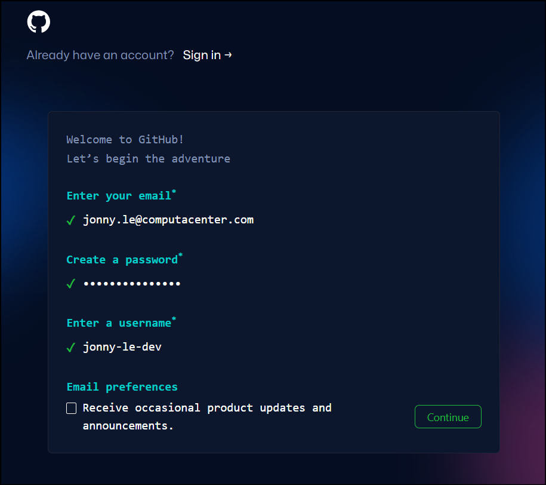
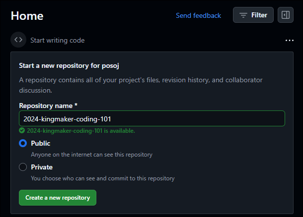
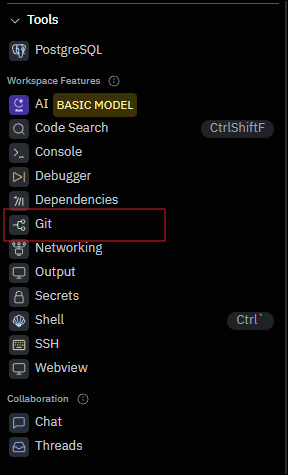
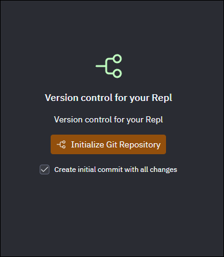
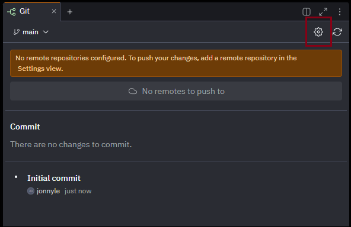
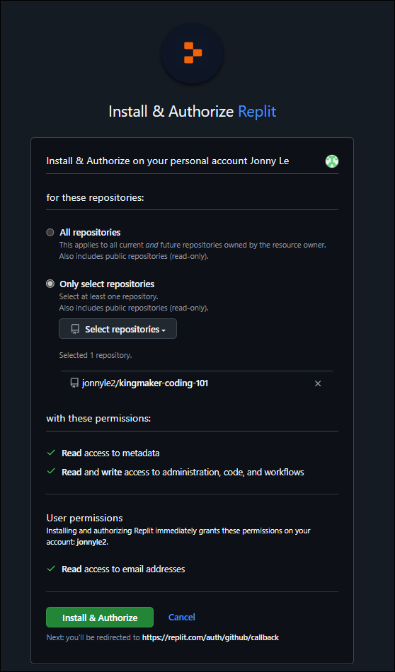
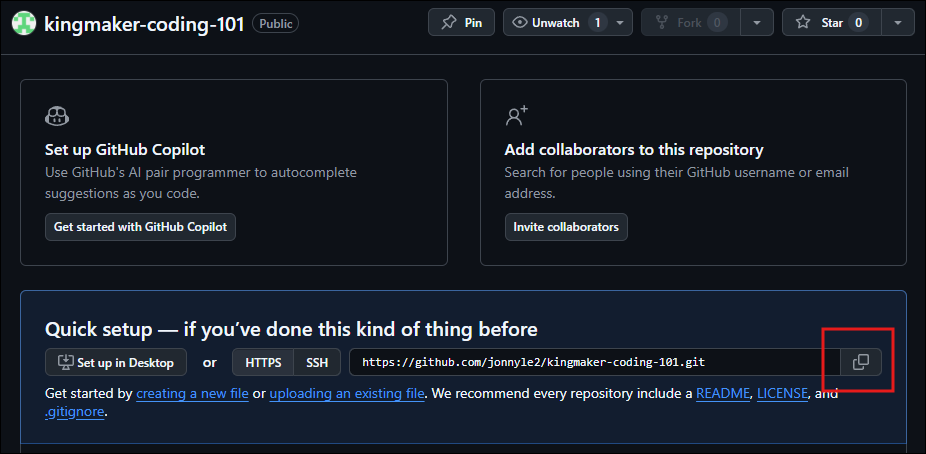
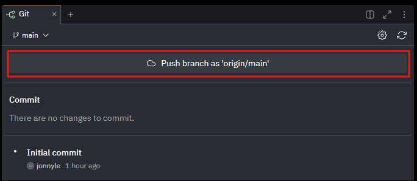

<!-- _class: title -->
# Creating Your First GitHub Account
Jonny Le
Computacenter Digital Innovation
CC Sales Associate Training 10/09/2024 - 10/10/2024

---

# Version Control Systems (VCS)

- **What?**
  - Tool to manage code changes over time
- **Why?**
  - Track and organize different versions
- **How?**
  - Git
  - Subversion (SVN)
  - Mercurial

<!--
** Git features:
- branching
- reverting/undo commits
- commit timestamp and logs
-->

---

# GitHub

- **What?**
  - Cloud-based platform to store, manage, and collaborate on code
- **Why?**
  - Central location to publicly (or privately) store source code
  - Enhanced collaborative features
  - Ease of use
- Git ≠ GitHub

---

# Create GitHub Account

- Prepare:
  - Email (and have your inbox ready to verify email)
  - Username
  - Password

1. https://github.com/signup
2. Follow prompt
3. Verify you're human
4. Verify email

---

# Your First Repository

---

# Initial Commit

---

# Connect GitHub to Replit

---

# Connect GitHub to Replit Cont.

